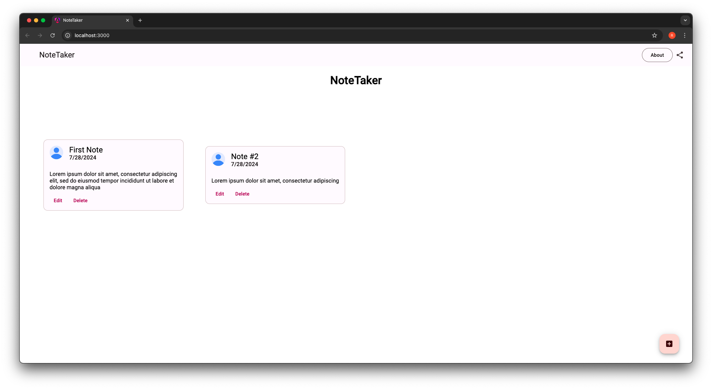
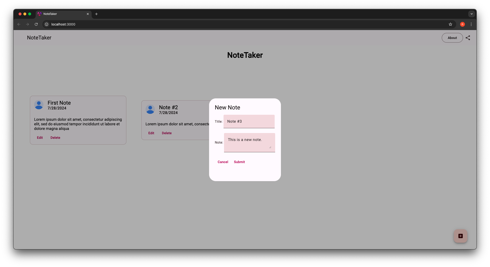
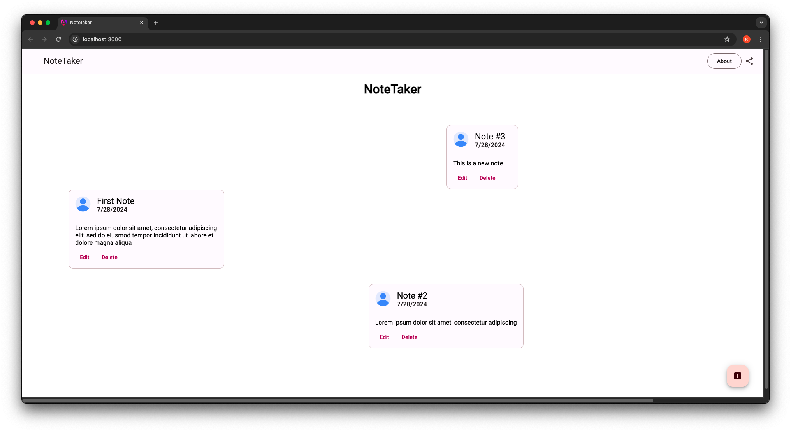
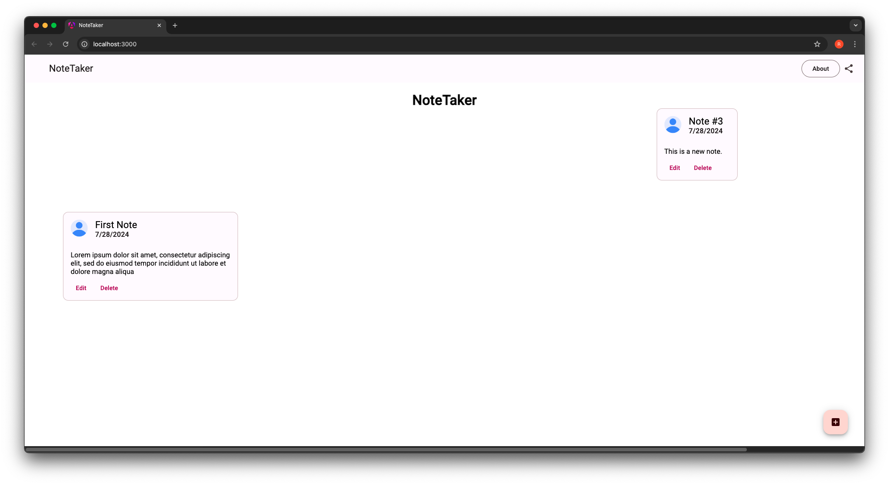

# NoteTaker

A full-stack web application using the MEAN Stack (MongoDB, Express.js, Angular, and Node.js)

# App functionality (work in progress)

## Display Notes
This is the home screen where notes are displayed.

## Add Notes
This is the popup form that allows the user to add a new note. Currently, there are two fields: title and note.

## Move Notes
The app allows the user to drag and drop notes to move them around the screen for custom organization.

## Delete Notes
The app allows the user to edit and delete notes using buttons given with each note.

